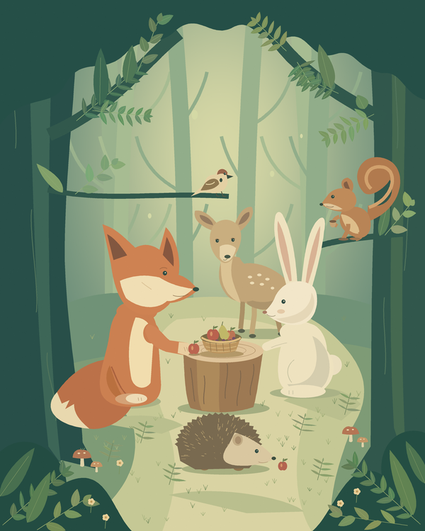
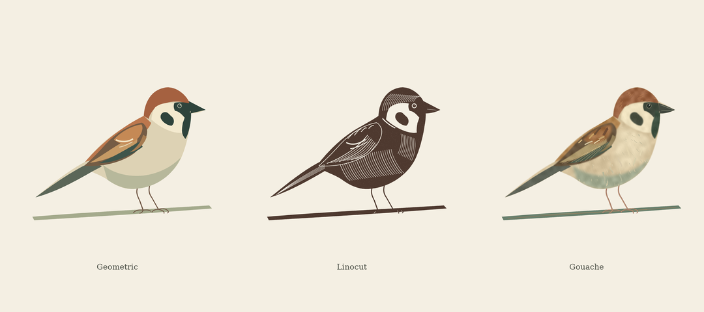

# cionejr

An experimental illustration skill for coding agents. Build from basic shapes, inspect the drawing, and repair craft problems before comparing styles.

[Skill](skills/cionejr/SKILL.md) · [Roadmap](docs/roadmap.md)



## What it does

cionejr turns a drawing brief into a construction and critique workflow. It covers flat shapes and volume, character actions, multiscale material detail, and full-page scene staging. Each style has its own execution checks; a poorly drawn alternative should not lose a taste comparison simply because it needs repair.

The skill is instructions, not a drawing model or editor plugin. It does not promise perfect anatomy or universal artistic taste. The sample renderers are small authored Python studies, not general-purpose drawing engines.

## Use the skill

Clone the repository and give your agent [SKILL.md](skills/cionejr/SKILL.md):

```bash
git clone https://github.com/bilhokista/cionejr.git
cd cionejr
```

For a host that discovers Agent Skills directories, copy the entire `skills/cionejr/` folder to the host's configured skills directory. Keep its references and templates together. The directory name and frontmatter name are both `cionejr`.

Automatic loading depends on your host. Do not assume that cloning the repository activates it. No global configuration is modified by this project.

Example requests:

> Use cionejr to draw a bird from this reference. Check the head/body transition before adding feathers.

> Use cionejr for one full-page woodland gathering without text. Inspect the layout and contacts before material detail.

> Compare three styles only after each is properly executed for the shared brief.

All core instructions, supporting guides, worksheets, and evaluation cases are in English. User-facing responses follow the language requested by the user.

## Examples



- [Bird styles](examples/bird-styles/): geometric colour planes, digital linocut-like cuts, and a painterly treatment inspired by gouache.
- [Forest gathering](examples/forest-gathering/): six fictional woodland characters around a fruit basket, 2400 x 3000, without text.

These are work-in-progress studies. The forest page still needs refinement. The [example notes](docs/examples.md) distinguish actual checks from unresolved quality work.

## Run the examples

Python 3.10+ is required for the tools and renderers, not for reading the skill.

```bash
python -m pip install -r requirements.txt
python tools/validate_skill.py
python -m unittest discover -s tests -v

python examples/bird-styles/render.py
python examples/bird-styles/test_outputs.py

python examples/forest-gathering/render.py --layout
python examples/forest-gathering/render.py
python examples/forest-gathering/test_outputs.py
```

Renderers write into their example directories and overwrite the corresponding sample PNGs. Copy files first if you want to preserve a revision. Bird labels use DejaVu Serif when available and Pillow's bundled fallback otherwise; font differences can change label pixels across machines. No proprietary font binaries are bundled.

## Package contents

```text
skills/cionejr/       Skill, construction/craft/scene guides, worksheet, evaluation cases
examples/            Reproducible authored studies and output checks
tools/               Skill metadata and local-link validator
tests/               Validator and example-portability tests
docs/                Sources, example status, and development priorities
```

## Evidence and limits

File tests check dimensions and basic output contracts. Skill validation checks YAML metadata and bundled links. Neither certifies anatomy, drawing competence, viewer understanding, or the effectiveness of an agent following the skill.

Behavioral evaluation cases are specifications, not passed benchmarks. There has been no controlled before/after study of an image generator. Third-party books are referenced by their public descriptions; they are not bundled or represented as fully read.

## Contributing and license

See [CONTRIBUTING.md](CONTRIBUTING.md). Prefer small, verifiable craft improvements over more decorative detail.

[MIT](LICENSE) applies to project-authored code, skill instructions, documentation, and original sample PNGs. Third-party works cited as references retain their own rights; none of their photographs, books, or font files are bundled. See [attribution](docs/attribution.md).
