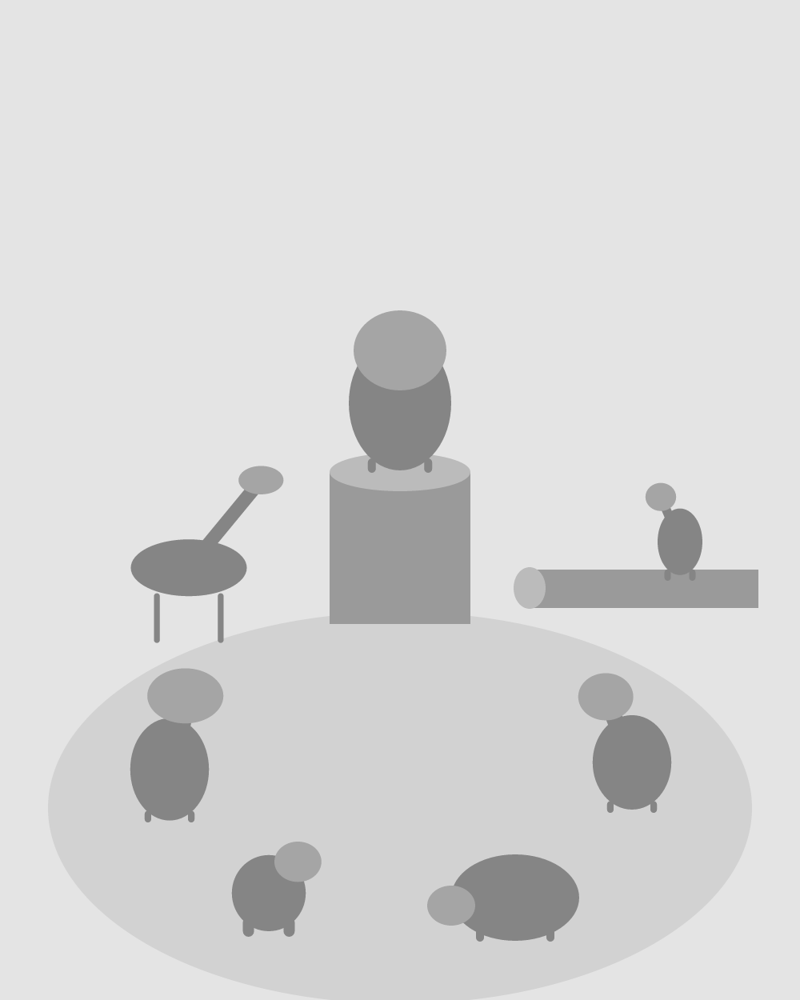
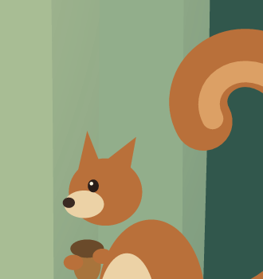
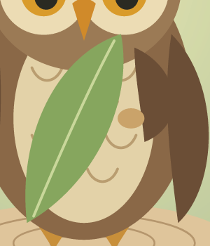
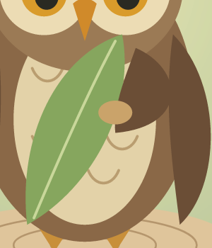

# Construction and contact repair, v0.1.2

## Scope and diagnosis

Keep the woodland meeting, cast, and SVG masters introduced in dcacc8e. Improve specific construction defects without replacing the scene or adding styles.

Two unintended gaps survived the existing file and global-placement tests because those checks did not inspect local attachment relationships. The finished greyscale image also stood in for a coarse mass layout.

| Problem filter | Evidence or limit |
|---|---|
| Symptom / cause | The squirrel head was separated from the torso; the owl grip missed its leaf. Independently positioned shapes and missing local-contact checks permitted these faults. A finished scene with hue removed still contains material detail. |
| Cost / purpose | This is an OSS craft task, not a market-validation claim. The relevant loss is the requested attachment/action failing in two observed locations; no monetary loss is asserted. |
| Falsification | Intentional separation would invalidate this diagnosis. Here the intended cartoon pose has attached anatomy and a held leaf. The baseline grip/leaf masks have zero overlap, and the squirrel head cannot reach the body in its rendered silhouette. |
| Existing workaround | Named SVG groups and no-character-overlap checks help editing and placement, but cannot establish internal attachment. More texture does not resolve either gap. |
| Atomic problem | An agent using this scene can deliver disconnected anatomy and a false grip while its output tests pass, because those tests cover page/character placement rather than the intended part-to-part contacts. |

This diagnosis is specific to the inspected example. It is not a ban on intentional separation or a proof of improved drawing on other briefs.

## Working-stage correction

`composition.png` now comes from coarse body/head envelopes and support planes in a separate mass builder. `layout.svg` keeps those envelopes as vector shapes. Neither includes faces, quill patterns, or decorative foliage.

This layout was opened before the contact repairs in this pass. It is a later diagnostic reconstruction of the existing composition, not proof that the original illustration began this way. The original desaturated final scene's role is now named accurately: `value-study.png`.

Use `python examples/forest-meeting/render.py --layout` to write only the layout. Open it before finishing. The default renderer writes both stages but does not automatically approve either.

## Same-area contact comparisons

Baseline files preserve dcacc8e. Crops below come from the 2400 x 3000 PNG at the same coordinates and without rescaling.

| Squirrel before | Squirrel after |
|---|---|
|  |  |

Repair: add a tapered connector between head and torso. Paint it behind the torso so its lower edge does not cut across the belly patch. Agent inspection: the background gap is closed and the belly patch is preserved. The curled tail remains unresolved.

| Owl before | Owl after |
|---|---|
|  |  |

Repair: repose the raised wing's tip and move the grip together. Agent inspection: the grip overlaps the leaf edge while staying connected to the wing. The holding gesture remains a simplified cartoon convention, not anatomically validated bird behavior.

The whole 600 x 750 preview was also opened. The cast placement and main event are retained. These local improvements do not make the whole illustration finished.

## Checks and their limits

Five construction tests cover a separate mass builder, a layout-only command that preserves finished art, squirrel head/body connectivity, grip/leaf overlap, and grip/wing overlap. The pre-existing grip/wing relation already passed; it is retained as a guard against repairing one end while breaking the other.

The missing layout behavior and two contact defects were observed to fail. A read-only Pillow flood-fill fixture was corrected, then both physical-contact regressions were reconfirmed against the original dcacc8e cast with its original draw callables. Revised tests pass. The thresholds are example-specific sampled-paint checks, not artistic scores.

The existing nine forest tests still check output contracts and selected global placement. Names now specify horizontal facing/alignment rather than claiming gaze or convincing support.

No viewer study was performed. The earlier agent evaluation run was not repeated for v0.1.2. New behavioral specifications 14 and 15 are not executed evaluations.

## Still revise

- Mechanical hedgehog quills and stiff deer hind legs.
- The mouse's ring-like body shading and the squirrel's spiral-like tail.
- Speaker-directed gaze beyond simple horizontal facing.
- Coarse grass-protection boxes and repetitive foliage construction.
- Character anatomy remains fictional; no species accuracy is claimed.

See the [roadmap](../../docs/roadmap.md). Preserve this record when the next pass changes the scene.
